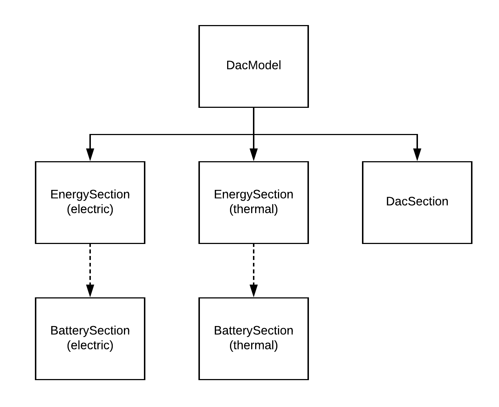

# carbonplan / dac-costing

**direct air capture + energy cost analysis**

[![GitHub][github-badge]][github]
![Build Status][]
![MIT License][]

[github]: https://github.com/carbonplan/dac-costing
[github-badge]: https://flat.badgen.net/badge/-/github?icon=github&label
[build status]: https://flat.badgen.net/github/checks/carbonplan/dac-costing
[mit license]: https://flat.badgen.net/badge/license/MIT/blue

A python module for estimating the cost of building and operating direct air capture facilities. Try it on Binder: [](https://mybinder.org/v2/gh/carbonplan/dac-costing/master)

## Documentation

This repository contains a simple Python module for analyzing various Direct Air
Capture configurations in terms of their energy and fiscal requirements.

### The `dac_costing` package

The `dac_costing` package includes two modules, `model` and `widget`.

The `model` module includes component classes that can be used to create various DAC scenarios.



#### Classes

- `BatterySection`: class for representing battery requirements
- `EnergySection`: class for representing the electric or thermal requirements of a system
- `DacSection`: class for representing the DAC facility (without its energy requirements)
- `DacModel`: class for representing the full/composite DAC system

#### Example usage

```python
params['Base Energy Requierement [MW]'] = 38
ebattery = BatterySection(**params)
electric = EnergySection('Solar', battery=ebattery, **params)

params['Base Energy Requierement [MW]'] = 234
tbattery = BatterySection(**params)
thermal = EnergySection('Solar', battery=tbattery, **params)

params['Total Capex [$]'] = 936.01
dac = DacSection(**params)

dac_all = DacModel(electric, thermal, dac, **params)
dac_all.compute().series
```

### Installing

```shell
pip install git+git://github.com/carbonplan/dac-costing@master
```
